# Stronghold

## Train

Example code:
```
cd apps
python train.py dataset=cifar10
```

if you want to check logs, please run the following code.

```
cd logs/train/[OUTPUT_DIR]
mlflow ui 
```

Hyperparam samples:
| dataset | batch size | ep  | optim | lr | mom | decay | schduler | step | gamma | ref
---- | ---- | ---- | ---- | ---- | ---- | ---- | ---- | ---- | ---- | ----
| CIFAR-10 | 32 (128) | 200 | SGD | 0.1 | 0.9 | 0.0001 | multistep | 100,150 | 0.1 | https://arxiv.org/abs/1908.08016 (https://arxiv.org/pdf/1512.03385.pdf)
| ImageNet | 256 | 90 | SGD | 0.1 | 0.9 | 0.0001 | multistep | 30,60,80 | 0.1 | https://arxiv.org/abs/1908.08016

## Transfer

Example code:
```
cd apps
python transfer.py weight=[PATH_TO_WEIGHT_OR_CHEKPOINT] original_num_classes=22 
```

Hyperparam samples:
| source | target | batch size | ep  | optim | lr | mom | decay | schduler | step | gamma | ref
---- | ---- | ---- | ---- | ---- | ---- | ---- | ---- | ---- | ---- | ---- | ----
| ImagNet | CIFAR | 128  | 50 | SGD | 0.01 | 0.9 | 0.0001 | step | 30 | 0.1 | https://openreview.net/pdf?id=ryebG04YvB

## Test

Currently following types of test are supported.

- acc: evaluate standard and robust accuracy.
- fourier: create Fourier heatmap.
- spacial: evaluate spacial sensitivity by patch shuffle.
- corruption: evaluate corruption accuracy. currently only CIFAR10-C is supported.

Example code:
```
cd apps
python test.py weight=[PATH_TO_WEIGHT] tester=acc
```
By default, .pth file is saved under `logs/train/yyyy-mm-dd_tt-mm-ss/checkpoint/epoch=XX-val_loss_avg=X.XX.ckpt`.

If you want to run multiple test at same time. Multi-run option of hydra is useful as follows.

Example code:
```
cd apps
python test.py weight=[PATH_TO_WEIGHT] tester=acc,fourier,spacial -m
```

## Note
### Train
| dataset | augmentation | model | batch size | ep  |  loss | train acc | val acc | mean corruption acc | optim | lr | mom | decay | schduler | step | gamma | id
---- | ---- | ---- | ---- | ---- | ---- | ---- | ---- | ---- | ---- | ---- | ---- | ---- | ---- | ---- | ---- | ----
| CIFAR-10 | -  | resnet56 | 256 | 90 | 0.4557 | 92.88 | 86.23 | 66.1 | SGD | 0.01 | 0.9 | 0.0001 | multi step | 30,60,80 | 0.1 | 2020-06-26_12-55-57_cifar10
| CIFAR-10 | Patch Gaussian | resnet56 | 256 | 90 | 0.4395 | 85.54 | 85.36 | 73.1 |  SGD | 0.01 | 0.9 | 0.0001 | multi step | 30,60,80 | 0.1 | 2020-07-03_16-25-20_cifar10_patch_gaussian
| fbdb_l2_basis-0031_cls-0022 | - | resnet50 | 256 | 90  | 0.1136  | 97.31 | 96.39 | - | SGD | 0.01 | 0.9 | 0.0001 | multi step | 30,60,80 | 0.1 | 2020-06-25_16-03-46_fbdb_l2_basis-0031_cls-0022
| fbdb_l2_basis-0031_cls-0022 | - | resnet56 | 256 | 90  | 0.04835  | 99.32 | 98.79  | - | SGD | 0.01 | 0.9 | 0.0001 | multi step | 30,60,80 | 0.1 | 2020-06-25_17-56-30_fbdb_l2_basis-0031_cls-0022
| fbdb_l2_basis-0031_cls-0022 | Patch Gaussian | resnet56 | 256 | 90 | 0.0583 | 98.61  | 98.57 | - | SGD | 0.01 | 0.9 | 0.0001 | multi step | 30,60,80 | 0.1 | 2020-07-03_17-01-17_fbdb_l2_basis-0031_cls-0022_patch_gaussian

### Transfer
#### from fbdb_l2_basis-0031_cls-0022
| source | source aug | target | target aug | model | batch size | ep  | loss | train acc | val acc | mean corruption acc | optim | lr | mom | decay | schduler | step | gamma | unfreeze | id
---- | ---- | ---- | ---- | ---- | ---- | ---- | ---- | ---- | ---- | ---- | ---- | ---- | ---- | ---- | ---- | ---- | ---- | ---- | ---- 
| fbdb_l2_basis-0031_cls-0022 | - | CIFAR-10 | - | resnet50 | 256 | 50 |  2.180 | 18.74 | 19.35 | - | SGD | 0.01 | 0.9 | 0.0001 | step      | 30       | 0.1 | level_0 | 2020-06-25_16-57-11_fbdb_l2_basis-0031_cls-0022_cifar10
| fbdb_l2_basis-0031_cls-0022 | - | CIFAR-10 | - | resnet50 | 256 | 90 |  2.138 | 20.60 | 21.18 | - | SGD | 0.01 | 0.9 | 0.0001 | multistep | 30,60,80 | 0.1 | level_0 | 2020-06-25_17-22-20_fbdb_l2_basis-0031_cls-0022_cifar10
| fbdb_l2_basis-0031_cls-0022 | - | CIFAR-10 | - | resnet56 | 256 | 90 |  1.919 | 30.50 | 32.12 | 23.2 | SGD | 0.01 | 0.9 | 0.0001 | multistep | 30,60,80 | 0.1 | level_0 | 2020-07-05_03-14-37_fbdb_l2_basis-0031_cls-0022_cifar10
| fbdb_l2_basis-0031_cls-0022 | - | CIFAR-10 | - | resnet56 | 256 | 90 |  0.997 | 67.19 | 65.39 | 49.9 | SGD | 0.01 | 0.9 | 0.0001 | multistep | 30,60,80 | 0.1 | level_1 | 2020-07-05_03-14-37_fbdb_l2_basis-0031_cls-0022_cifar10
| fbdb_l2_basis-0031_cls-0022 | - | CIFAR-10 | - | resnet56 | 256 | 90 |  0.660 | 83.24 | 78.18 | 60.2 | SGD | 0.01 | 0.9 | 0.0001 | multistep | 30,60,80 | 0.1 | level_2 | 2020-07-05_03-14-37_fbdb_l2_basis-0031_cls-0022_cifar10
| fbdb_l2_basis-0031_cls-0022 | - | CIFAR-10 | - | resnet56 | 256 | 90 |  0.463 | 92.92 | 86.33 | 63.5 | SGD | 0.01 | 0.9 | 0.0001 | multistep | 30,60,80 | 0.1 | level_3 | 2020-07-05_03-14-37_fbdb_l2_basis-0031_cls-0022_cifar10
| fbdb_l2_basis-0031_cls-0022 | patch gaussian | CIFAR-10 | - | resnet56 | 256 | 90 | 1.933 | 30.27 | 32.27 | 24.8 | SGD | 0.01 | 0.9 | 0.0001 | multistep | 30,60,80 | 0.1 | level_0 | 2020-07-04_07-06-54_fbdb_l2_basis-0031_cls-0022_patch_gaussian_cifar10
| fbdb_l2_basis-0031_cls-0022 | patch gaussian | CIFAR-10 | - | resnet56 | 256 | 90 | 0.962 | 65.84 | 63.77 | 50.3 | SGD | 0.01 | 0.9 | 0.0001 | multistep | 30,60,80 | 0.1 | level_1 | 2020-07-04_07-06-54_fbdb_l2_basis-0031_cls-0022_patch_gaussian_cifar10
| fbdb_l2_basis-0031_cls-0022 | patch gaussian | CIFAR-10 | - | resnet56 | 256 | 90 | 0.454 | 83.01 | 77.70 | 62.1 | SGD | 0.01 | 0.9 | 0.0001 | multistep | 30,60,80 | 0.1 | level_2 | 2020-07-04_07-06-54_fbdb_l2_basis-0031_cls-0022_patch_gaussian_cifar10
| fbdb_l2_basis-0031_cls-0022 | patch gaussian | CIFAR-10 | - | resnet56 | 256 | 90 | 0.216 | 92.51 | 85.25 | 63.9 | SGD | 0.01 | 0.9 | 0.0001 | multistep | 30,60,80 | 0.1 | level_3 | 2020-07-04_07-06-54_fbdb_l2_basis-0031_cls-0022_patch_gaussian_cifar10


#### from fbdb_full_basis-0031_cls-0961

coming soon

### Test

#### Fourier heatmap

| dataset | model | eps | source | source aug | target | target aug | unfreeze | heatmap | samples | corruption | vanilla grad | loss grad | id
---- | ---- | ---- | ---- | ---- | ---- | ---- | ---- | ---- | ---- | ---- | ---- | ---- | ----
| cifar10 | resnet56 | 16(l2) | cifar10 | -              | - | - | - | 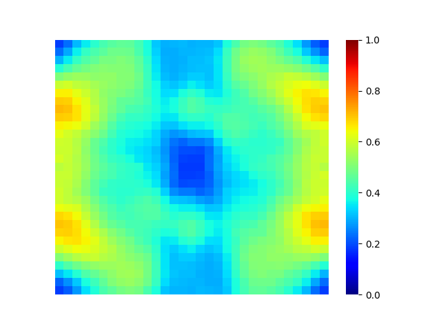 | 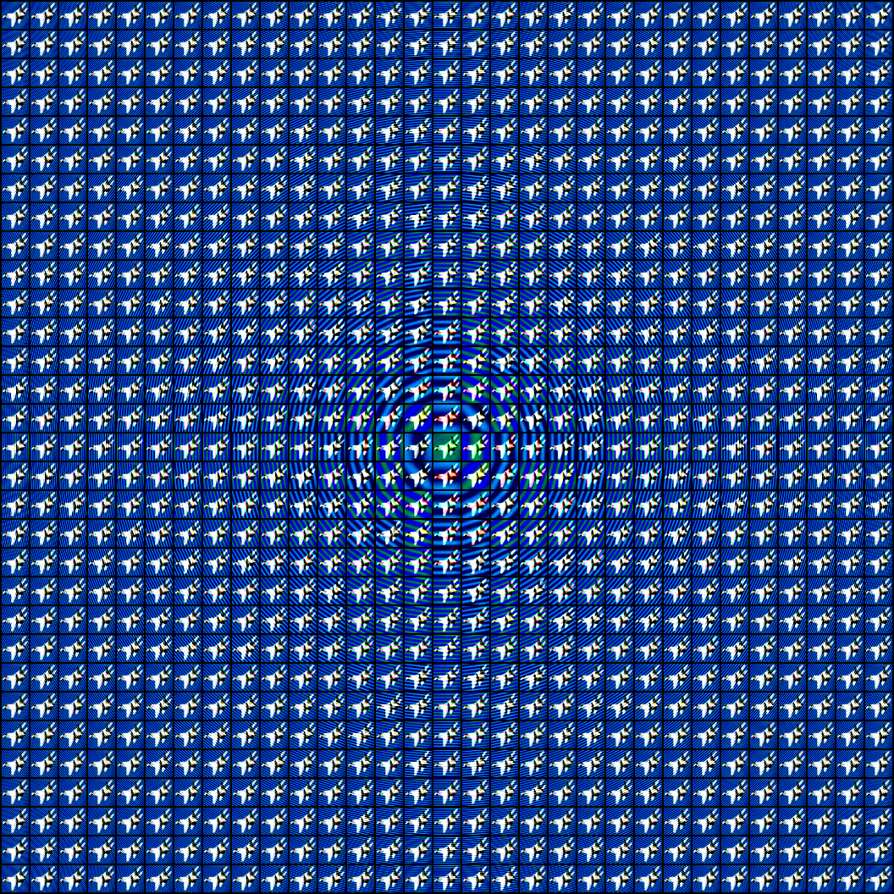 | 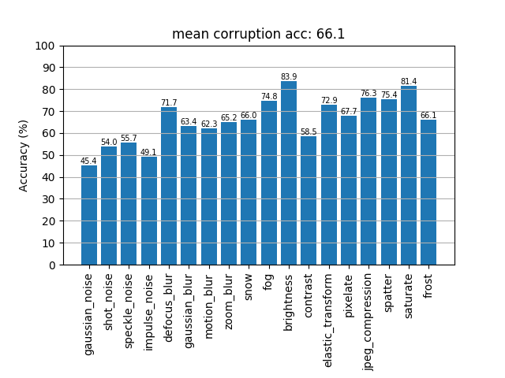 |  |  | 2020-06-26_12-55-57_cifar10
| cifar10 | resnet56 | 16(l2) | cifar10 | patch gaussian | - | - | - | 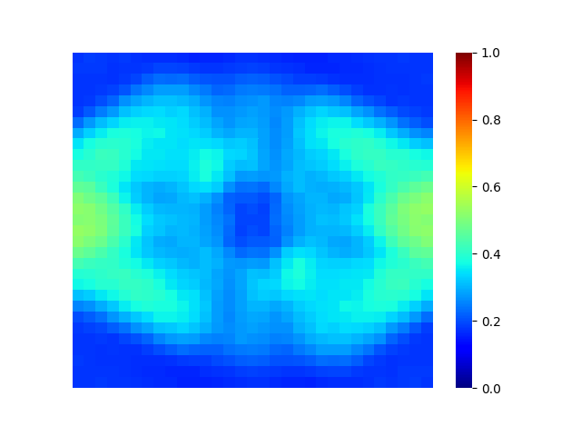 |  |   |   |   | 2020-07-03_16-25-20_cifar10_patch_gaussian
| cifar10 | resnet56 | | cifar10 PGD-AT (linf 8) | - | - | - | - | - | - | - |   |  |
| fbdb_l2_basis-0031_cls-0022 | resnet56 | 16(l2) | fbdb_l2_basis-0031_cls-0022 | - | - | - | - |  |  | - | - | - |2020-06-25_17-56-30_fbdb_l2_basis-0031_cls-0022
| fbdb_l2_basis-0031_cls-0022 | resnet56 | 16(l2) | fbdb_l2_basis-0031_cls-0022 | patch gaussian | - | - | - | 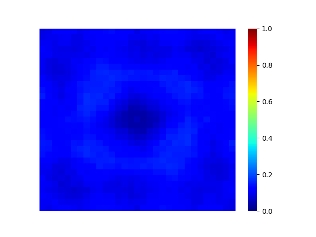 |   | - | - | - | 2020-07-03_17-01-17_fbdb_l2_basis-0031_cls-0022 
| cifar10 | resnet56 | 16(l2) | fbdb_l2_basis-0031_cls-0022 | - | cifar10 | - | level0 |  | 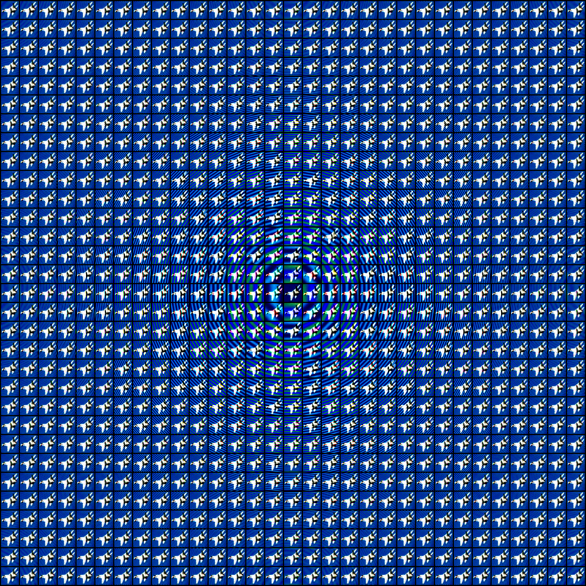 | 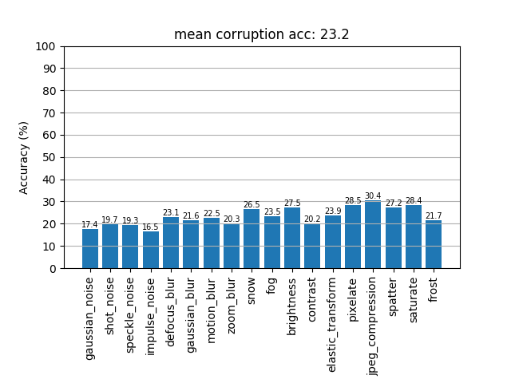 |  |  | 2020-07-05_04-54-18_fbdb_l2_basis-0031_cls-0022_cifar10
| cifar10 | resnet56 | 16(l2) | fbdb_l2_basis-0031_cls-0022 | - | cifar10 | - | level1 | 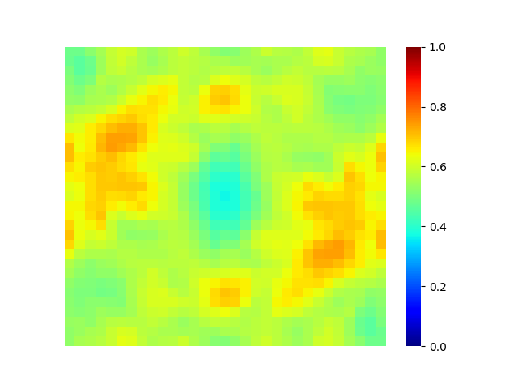 |  | 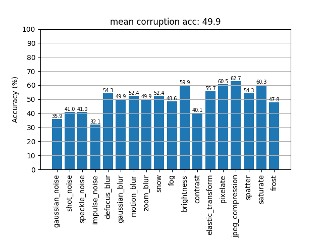 | 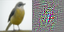 |  | 2020-07-05_04-54-18_fbdb_l2_basis-0031_cls-0022_cifar10
| cifar10 | resnet56 | 16(l2) | fbdb_l2_basis-0031_cls-0022 | - | cifar10 | - | level2 | 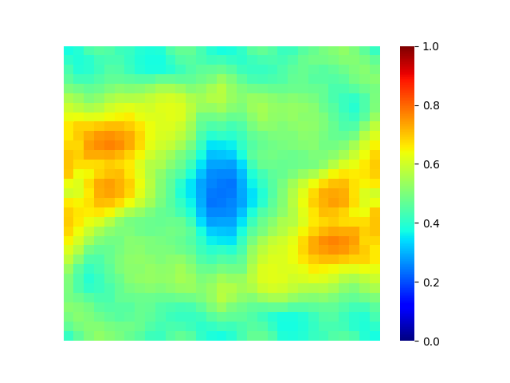 | 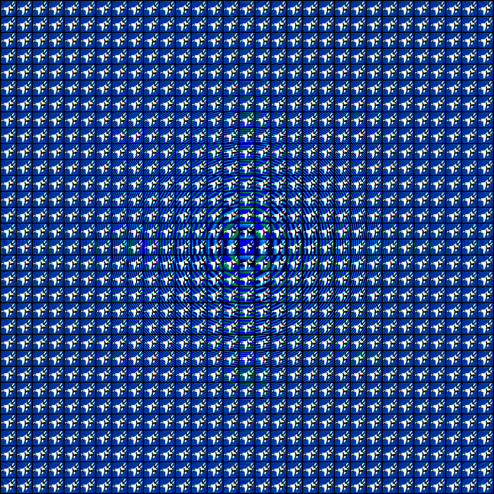 | 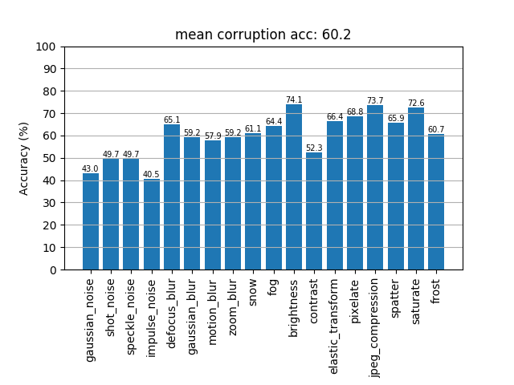 |  |  | 2020-07-05_04-54-18_fbdb_l2_basis-0031_cls-0022_cifar10
| cifar10 | resnet56 | 16(l2) | fbdb_l2_basis-0031_cls-0022 | - | cifar10 | - | level3 |  | 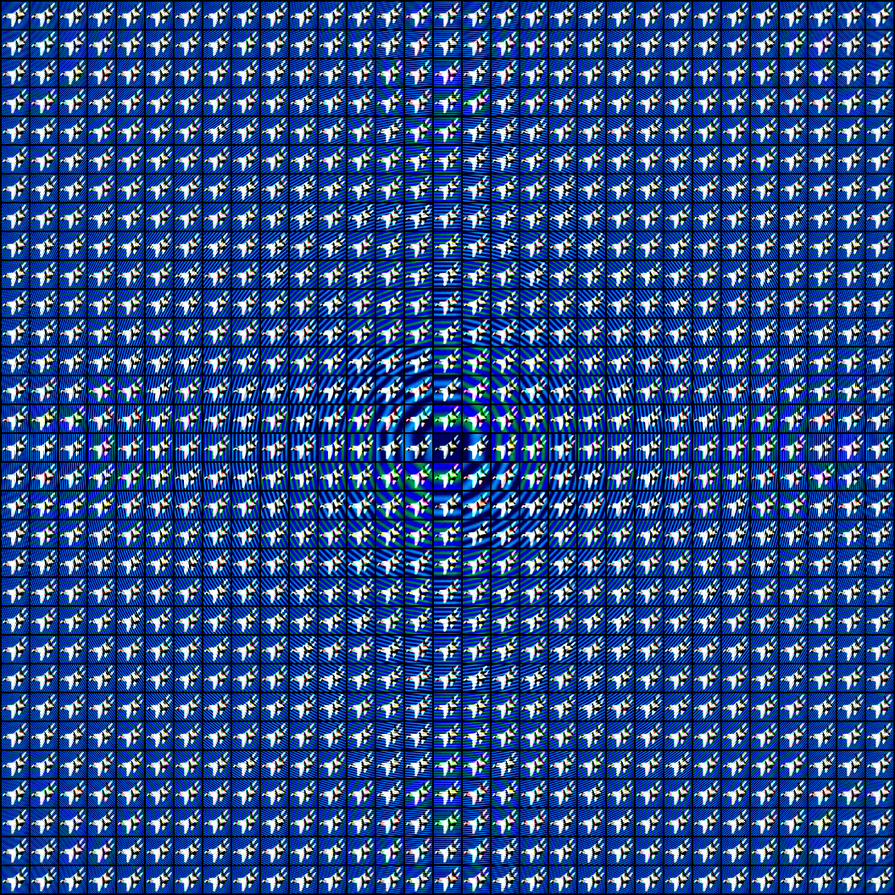 | 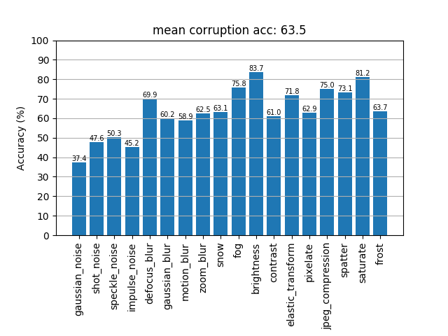 |  |  | 2020-07-05_04-54-18_fbdb_l2_basis-0031_cls-0022_cifar10
| cifar10 | resnet56 | 16(l2) | fbdb_l2_basis-0031_cls-0022 | patch gaussian | cifar10 | - | level0 | 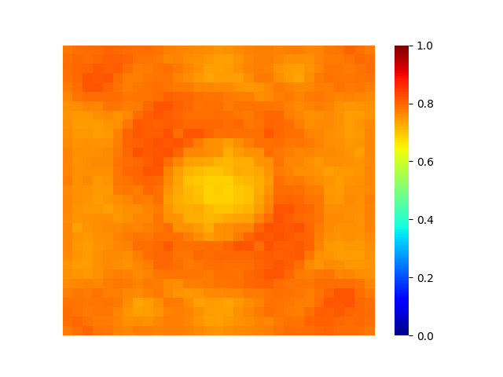 | 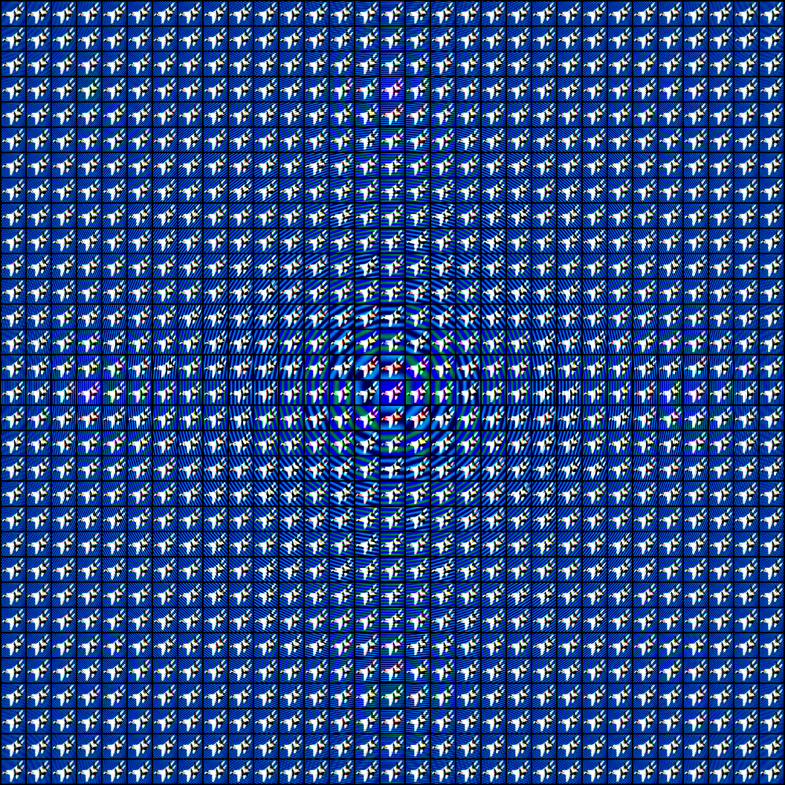 |  |  | 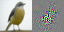 |2020-07-04_07-06-54_fbdb_l2_basis-0031_cls-0022_patch_gaussian_cifar10
| cifar10 | resnet56 | 16(l2) | fbdb_l2_basis-0031_cls-0022 | patch gaussian | cifar10 | - | level1 |  |  | 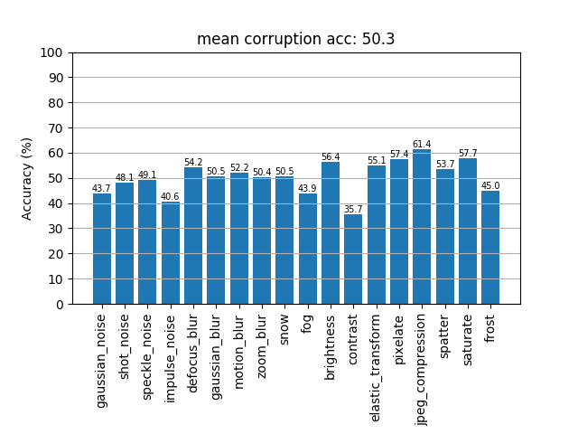 | 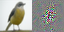 |  |2020-07-04_07-06-54_fbdb_l2_basis-0031_cls-0022_patch_gaussian_cifar10
| cifar10 | resnet56 | 16(l2) | fbdb_l2_basis-0031_cls-0022 | patch gaussian | cifar10 | - | level2 | 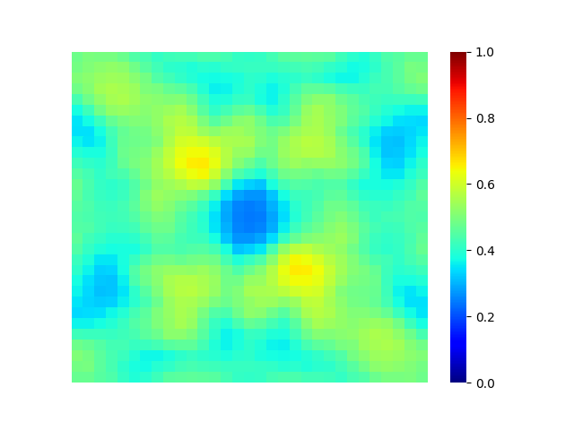 |  |  |  |  |2020-07-04_07-06-54_fbdb_l2_basis-0031_cls-0022_patch_gaussian_cifar10
| cifar10 | resnet56 | 16(l2) | fbdb_l2_basis-0031_cls-0022 | patch gaussian | cifar10 | - | level3 | 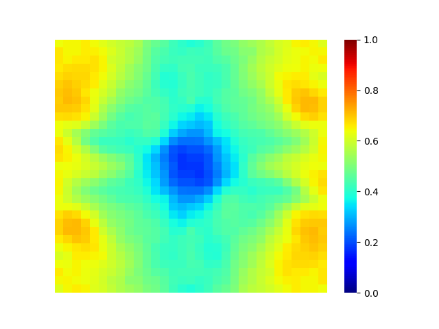 |  |  |  |  |2020-07-04_07-06-54_fbdb_l2_basis-0031_cls-0022_patch_gaussian_cifar10

#### Spacial sensitivity

| model | source | source aug | target | target aug | spacial sensitivity |
| - | - | - | - | - | - |
| resnet56 | fbdb_l2_basis-0031_cls-0022 | patch gaussian | cifar10 | -  | 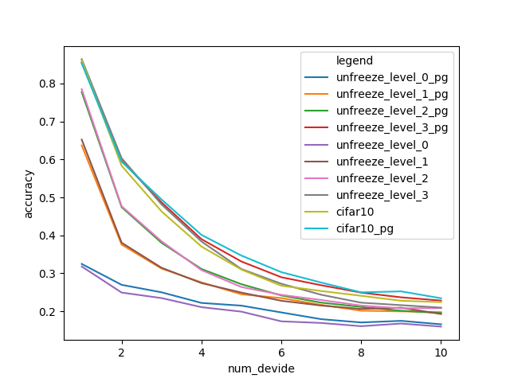

### Named Params
| model | keys |
---- | ----
| resnet50 | 'conv1.weight', 'bn1.weight', 'bn1.bias', 'layer1.0.conv1.weight', 'layer1.0.bn1.weight', 'layer1.0.bn1.bias', 'layer1.0.conv2.weight', 'layer1.0.bn2.weight', 'layer1.0.bn2.bias', 'layer1.0.conv3.weight', 'layer1.0.bn3.weight', 'layer1.0.bn3.bias', 'layer1.0.downsample.0.weight', 'layer1.0.downsample.1.weight', 'layer1.0.downsample.1.bias', 'layer1.1.conv1.weight', 'layer1.1.bn1.weight', 'layer1.1.bn1.bias', 'layer1.1.conv2.weight', 'layer1.1.bn2.weight', 'layer1.1.bn2.bias', 'layer1.1.conv3.weight', 'layer1.1.bn3.weight', 'layer1.1.bn3.bias', 'layer1.2.conv1.weight', 'layer1.2.bn1.weight', 'layer1.2.bn1.bias', 'layer1.2.conv2.weight', 'layer1.2.bn2.weight', 'layer1.2.bn2.bias', 'layer1.2.conv3.weight', 'layer1.2.bn3.weight', 'layer1.2.bn3.bias', 'layer2.0.conv1.weight', 'layer2.0.bn1.weight', 'layer2.0.bn1.bias', 'layer2.0.conv2.weight', 'layer2.0.bn2.weight', 'layer2.0.bn2.bias', 'layer2.0.conv3.weight', 'layer2.0.bn3.weight', 'layer2.0.bn3.bias', 'layer2.0.downsample.0.weight', 'layer2.0.downsample.1.weight', 'layer2.0.downsample.1.bias', 'layer2.1.conv1.weight', 'layer2.1.bn1.weight', 'layer2.1.bn1.bias', 'layer2.1.conv2.weight', 'layer2.1.bn2.weight', 'layer2.1.bn2.bias', 'layer2.1.conv3.weight', 'layer2.1.bn3.weight', 'layer2.1.bn3.bias', 'layer2.2.conv1.weight', 'layer2.2.bn1.weight', 'layer2.2.bn1.bias', 'layer2.2.conv2.weight', 'layer2.2.bn2.weight', 'layer2.2.bn2.bias', 'layer2.2.conv3.weight', 'layer2.2.bn3.weight', 'layer2.2.bn3.bias', 'layer2.3.conv1.weight', 'layer2.3.bn1.weight', 'layer2.3.bn1.bias', 'layer2.3.conv2.weight', 'layer2.3.bn2.weight', 'layer2.3.bn2.bias', 'layer2.3.conv3.weight', 'layer2.3.bn3.weight', 'layer2.3.bn3.bias', 'layer3.0.conv1.weight', 'layer3.0.bn1.weight', 'layer3.0.bn1.bias', 'layer3.0.conv2.weight', 'layer3.0.bn2.weight', 'layer3.0.bn2.bias', 'layer3.0.conv3.weight', 'layer3.0.bn3.weight', 'layer3.0.bn3.bias', 'layer3.0.downsample.0.weight', 'layer3.0.downsample.1.weight', 'layer3.0.downsample.1.bias', 'layer3.1.conv1.weight', 'layer3.1.bn1.weight', 'layer3.1.bn1.bias', 'layer3.1.conv2.weight', 'layer3.1.bn2.weight', 'layer3.1.bn2.bias', 'layer3.1.conv3.weight', 'layer3.1.bn3.weight', 'layer3.1.bn3.bias', 'layer3.2.conv1.weight', 'layer3.2.bn1.weight', 'layer3.2.bn1.bias', 'layer3.2.conv2.weight', 'layer3.2.bn2.weight', 'layer3.2.bn2.bias', 'layer3.2.conv3.weight', 'layer3.2.bn3.weight', 'layer3.2.bn3.bias', 'layer3.3.conv1.weight', 'layer3.3.bn1.weight', 'layer3.3.bn1.bias', 'layer3.3.conv2.weight', 'layer3.3.bn2.weight', 'layer3.3.bn2.bias', 'layer3.3.conv3.weight', 'layer3.3.bn3.weight', 'layer3.3.bn3.bias', 'layer3.4.conv1.weight', 'layer3.4.bn1.weight', 'layer3.4.bn1.bias', 'layer3.4.conv2.weight', 'layer3.4.bn2.weight', 'layer3.4.bn2.bias', 'layer3.4.conv3.weight', 'layer3.4.bn3.weight', 'layer3.4.bn3.bias', 'layer3.5.conv1.weight', 'layer3.5.bn1.weight', 'layer3.5.bn1.bias', 'layer3.5.conv2.weight', 'layer3.5.bn2.weight', 'layer3.5.bn2.bias', 'layer3.5.conv3.weight', 'layer3.5.bn3.weight', 'layer3.5.bn3.bias', 'layer4.0.conv1.weight', 'layer4.0.bn1.weight', 'layer4.0.bn1.bias', 'layer4.0.conv2.weight', 'layer4.0.bn2.weight', 'layer4.0.bn2.bias', 'layer4.0.conv3.weight', 'layer4.0.bn3.weight', 'layer4.0.bn3.bias', 'layer4.0.downsample.0.weight', 'layer4.0.downsample.1.weight', 'layer4.0.downsample.1.bias', 'layer4.1.conv1.weight', 'layer4.1.bn1.weight', 'layer4.1.bn1.bias', 'layer4.1.conv2.weight', 'layer4.1.bn2.weight', 'layer4.1.bn2.bias', 'layer4.1.conv3.weight', 'layer4.1.bn3.weight', 'layer4.1.bn3.bias', 'layer4.2.conv1.weight', 'layer4.2.bn1.weight', 'layer4.2.bn1.bias', 'layer4.2.conv2.weight', 'layer4.2.bn2.weight', 'layer4.2.bn2.bias', 'layer4.2.conv3.weight', 'layer4.2.bn3.weight', 'layer4.2.bn3.bias', 'fc.weight', 'fc.bias'
| resnet56 | 'conv1.weight', 'bn1.weight', 'bn1.bias', 'layer1.0.conv1.weight', 'layer1.0.bn1.weight', 'layer1.0.bn1.bias', 'layer1.0.conv2.weight', 'layer1.0.bn2.weight', 'layer1.0.bn2.bias', 'layer1.1.conv1.weight', 'layer1.1.bn1.weight', 'layer1.1.bn1.bias', 'layer1.1.conv2.weight', 'layer1.1.bn2.weight', 'layer1.1.bn2.bias', 'layer1.2.conv1.weight', 'layer1.2.bn1.weight', 'layer1.2.bn1.bias', 'layer1.2.conv2.weight', 'layer1.2.bn2.weight', 'layer1.2.bn2.bias', 'layer1.3.conv1.weight', 'layer1.3.bn1.weight', 'layer1.3.bn1.bias', 'layer1.3.conv2.weight', 'layer1.3.bn2.weight', 'layer1.3.bn2.bias', 'layer1.4.conv1.weight', 'layer1.4.bn1.weight', 'layer1.4.bn1.bias', 'layer1.4.conv2.weight', 'layer1.4.bn2.weight', 'layer1.4.bn2.bias', 'layer1.5.conv1.weight', 'layer1.5.bn1.weight', 'layer1.5.bn1.bias', 'layer1.5.conv2.weight', 'layer1.5.bn2.weight', 'layer1.5.bn2.bias', 'layer1.6.conv1.weight', 'layer1.6.bn1.weight', 'layer1.6.bn1.bias', 'layer1.6.conv2.weight', 'layer1.6.bn2.weight', 'layer1.6.bn2.bias', 'layer1.7.conv1.weight', 'layer1.7.bn1.weight', 'layer1.7.bn1.bias', 'layer1.7.conv2.weight', 'layer1.7.bn2.weight', 'layer1.7.bn2.bias', 'layer1.8.conv1.weight', 'layer1.8.bn1.weight', 'layer1.8.bn1.bias', 'layer1.8.conv2.weight', 'layer1.8.bn2.weight', 'layer1.8.bn2.bias', 'layer2.0.conv1.weight', 'layer2.0.bn1.weight', 'layer2.0.bn1.bias', 'layer2.0.conv2.weight', 'layer2.0.bn2.weight', 'layer2.0.bn2.bias', 'layer2.1.conv1.weight', 'layer2.1.bn1.weight', 'layer2.1.bn1.bias', 'layer2.1.conv2.weight', 'layer2.1.bn2.weight', 'layer2.1.bn2.bias', 'layer2.2.conv1.weight', 'layer2.2.bn1.weight', 'layer2.2.bn1.bias', 'layer2.2.conv2.weight', 'layer2.2.bn2.weight', 'layer2.2.bn2.bias', 'layer2.3.conv1.weight', 'layer2.3.bn1.weight', 'layer2.3.bn1.bias', 'layer2.3.conv2.weight', 'layer2.3.bn2.weight', 'layer2.3.bn2.bias', 'layer2.4.conv1.weight', 'layer2.4.bn1.weight', 'layer2.4.bn1.bias', 'layer2.4.conv2.weight', 'layer2.4.bn2.weight', 'layer2.4.bn2.bias', 'layer2.5.conv1.weight', 'layer2.5.bn1.weight', 'layer2.5.bn1.bias', 'layer2.5.conv2.weight', 'layer2.5.bn2.weight', 'layer2.5.bn2.bias', 'layer2.6.conv1.weight', 'layer2.6.bn1.weight', 'layer2.6.bn1.bias', 'layer2.6.conv2.weight', 'layer2.6.bn2.weight', 'layer2.6.bn2.bias', 'layer2.7.conv1.weight', 'layer2.7.bn1.weight', 'layer2.7.bn1.bias', 'layer2.7.conv2.weight', 'layer2.7.bn2.weight', 'layer2.7.bn2.bias', 'layer2.8.conv1.weight', 'layer2.8.bn1.weight', 'layer2.8.bn1.bias', 'layer2.8.conv2.weight', 'layer2.8.bn2.weight', 'layer2.8.bn2.bias', 'layer3.0.conv1.weight', 'layer3.0.bn1.weight', 'layer3.0.bn1.bias', 'layer3.0.conv2.weight', 'layer3.0.bn2.weight', 'layer3.0.bn2.bias', 'layer3.1.conv1.weight', 'layer3.1.bn1.weight', 'layer3.1.bn1.bias', 'layer3.1.conv2.weight', 'layer3.1.bn2.weight', 'layer3.1.bn2.bias', 'layer3.2.conv1.weight', 'layer3.2.bn1.weight', 'layer3.2.bn1.bias', 'layer3.2.conv2.weight', 'layer3.2.bn2.weight', 'layer3.2.bn2.bias', 'layer3.3.conv1.weight', 'layer3.3.bn1.weight', 'layer3.3.bn1.bias', 'layer3.3.conv2.weight', 'layer3.3.bn2.weight', 'layer3.3.bn2.bias', 'layer3.4.conv1.weight', 'layer3.4.bn1.weight', 'layer3.4.bn1.bias', 'layer3.4.conv2.weight', 'layer3.4.bn2.weight', 'layer3.4.bn2.bias', 'layer3.5.conv1.weight', 'layer3.5.bn1.weight', 'layer3.5.bn1.bias', 'layer3.5.conv2.weight', 'layer3.5.bn2.weight', 'layer3.5.bn2.bias', 'layer3.6.conv1.weight', 'layer3.6.bn1.weight', 'layer3.6.bn1.bias', 'layer3.6.conv2.weight', 'layer3.6.bn2.weight', 'layer3.6.bn2.bias', 'layer3.7.conv1.weight', 'layer3.7.bn1.weight', 'layer3.7.bn1.bias', 'layer3.7.conv2.weight', 'layer3.7.bn2.weight', 'layer3.7.bn2.bias', 'layer3.8.conv1.weight', 'layer3.8.bn1.weight', 'layer3.8.bn1.bias', 'layer3.8.conv2.weight', 'layer3.8.bn2.weight', 'layer3.8.bn2.bias', 'linear.weight', 'linear.bias'