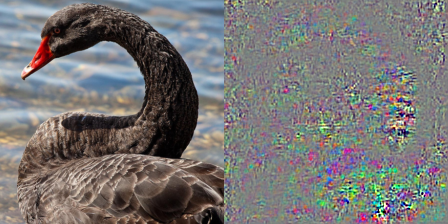
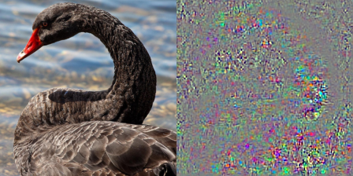

# Feature Visualizer

## Gradient based sensitivity map
If you want to create gradinet based sensitivity map,
the classes in `libs/sensitivity_map.py` are useful.

By running `python sensitivity_map.py`, a sample image like following is saved under `logs/`.

#### Vanilla Gradient (VanillaGrad)

#### Loss Gradient (LossGrad)

## First layer visualization
If you want to check the weight of convolutional filters in a first layer,
the function `save_first_layer_weight`  in `libs/first_layer.py`  is useful.

By running `python first_layer.py`, a sample image like following is saved under `logs/`.

